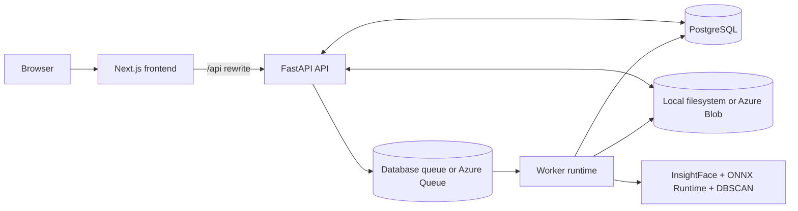

# Face-Me

Face-Me is a full-stack photo organization app that detects faces in uploaded images, extracts embeddings, clusters similar faces into people, and lets users browse the results in a dashboard.

This repository is organized as a small monorepo:

- `frontend/` contains the Next.js web app.
- `backend/` contains the FastAPI API, the background worker runtime, the database models, and the face-processing pipeline.
- `docker-compose.yml` wires local Postgres, the API container, the worker container, and the frontend together.
- `scripts/` and `backend/scripts/` contain smoke tests for end-to-end verification.

## What the product does

At a high level, a user signs in, uploads photos, starts a processing job, and then sees the photos grouped by person. Under the hood the app:

1. Accepts uploads from the browser or imports images from Google Drive.
2. Stores original images in local disk storage or Azure Blob Storage.
3. Creates persistent `Image` and `PipelineJob` records in the database.
4. Runs a background worker that downloads the images, detects faces with InsightFace, and stores cropped face thumbnails plus embeddings.
5. Runs DBSCAN clustering across that user's embeddings.
6. Exposes clusters, images, and asset URLs back to the frontend for browsing and renaming.

## Architecture



## Stack

| Layer | Technology | Notes |
| --- | --- | --- |
| Frontend | Next.js 16, React 19, TypeScript | App Router app with client-side auth gating and `/api` rewrites |
| UI | Tailwind CSS v4, shadcn/ui, Radix UI, Framer Motion, Lucide | Dark-first dashboard and marketing site |
| API | FastAPI, SQLAlchemy, Alembic | Cookie-based auth, upload orchestration, asset serving, job APIs |
| Worker | FastAPI worker app + threaded runtime | Runs the face-processing pipeline and queue polling |
| Database | PostgreSQL in normal development and production | SQLite is only used in tests/smoke checks |
| Storage | Local filesystem or Azure Blob Storage | Originals and cropped faces are stored separately |
| Queue | Database polling or Azure Queue Storage | Database queue is the local default |
| ML pipeline | InsightFace, ONNX Runtime, OpenCV, NumPy, scikit-learn | CPU inference and DBSCAN clustering |
| Deployment | Docker, Docker Compose, Azure Container Apps, Vercel | Current production-oriented topology |

## Repository layout

```text
.
├── backend/
│   ├── app/
│   │   ├── routers/          # HTTP routes
│   │   ├── services/         # storage, queue, drive, clustering, face engine
│   │   ├── auth.py           # session creation and cookie auth
│   │   ├── config.py         # env loading and defaults
│   │   ├── database.py       # SQLAlchemy engine/session
│   │   ├── main.py           # API entrypoint
│   │   ├── worker_app.py     # worker health app entrypoint
│   │   └── worker_runtime.py # polling loop
│   ├── alembic/              # database migrations
│   ├── tests/                # backend unittest suite
│   ├── scripts/              # backend smoke test
│   ├── Dockerfile
│   └── requirements.txt
├── frontend/
│   ├── src/app/              # Next.js routes
│   ├── src/components/       # dashboard layout, dropzone, UI primitives
│   ├── src/lib/              # auth context and API client
│   ├── Dockerfile
│   └── package.json
├── docker-compose.yml
├── scripts/smoke_test.py
└── README.md
```

## End-to-end data flow

### 1. Authentication

- The frontend calls `POST /api/auth/register` or `POST /api/auth/login`.
- The backend hashes the password with bcrypt, creates a random session token, stores only the SHA-256 hash in the `sessions` table, and sets an HTTP-only cookie.
- On page load the frontend auth context calls `GET /api/auth/me` and keeps the current user in memory.
- Protected pages are client-gated. Anything outside `/`, `/signin`, and `/signup` redirects to `/signin` when no session is present.

### 2. Upload initiation

- The upload page collects files locally in the browser.
- The frontend calls `POST /api/uploads/initiate` with file metadata only.
- The backend validates MIME type and size, then returns one upload target per file.
- In local mode the target is an authenticated backend route like `PUT /api/uploads/local/uploads/{storage_key}`.
- In Azure mode the target is a signed Blob Storage URL with the required headers.

### 3. Upload completion

- The browser uploads file bytes directly to the returned target.
- The frontend then calls `POST /api/uploads/complete`.
- The backend verifies that each uploaded object exists in storage and creates `Image` rows with metadata such as original filename, source, content type, byte size, and status.

### 4. Pipeline job creation

- The frontend calls `POST /api/pipeline`.
- The backend creates a `pipeline_jobs` record with status `queued`, a short generated job ID, a JSON payload, and zeroed progress.
- The queue service is notified:
  - In database mode there is no external message; the worker simply polls queued rows.
  - In Azure mode the worker reads from Azure Queue Storage.

### 5. Background processing

- The worker claims the job and updates status/progress.
- `process_images()` downloads original image bytes from storage.
- OpenCV decodes the image and InsightFace detects faces plus normalized embeddings.
- Each detected face is cropped, resized to `160x160`, JPEG-encoded, written to the `faces` storage area, and persisted in the `faces` table alongside the embedding bytes and bounding box JSON.
- Images are marked `processed` on success or `failed` with `processing_error` if detection fails.

### 6. Clustering

- After face extraction, the worker runs DBSCAN with cosine distance across all face embeddings for that user.
- Noise points receive no cluster ID and show up in the ungrouped view.
- For each non-noise cluster, the backend creates a `Cluster` row and picks the representative face with the highest detection score.

### 7. Result delivery

- The upload page polls `GET /api/jobs/{job_id}` until the job is `completed` or `failed`.
- Dashboard pages fetch:
  - `GET /api/images`
  - `GET /api/clusters`
  - `GET /api/clusters/{id}`
  - `GET /api/ungrouped`
- The backend returns asset URLs rather than raw filenames.

### 8. Asset serving

- In local storage mode asset URLs point back to authenticated backend routes under `/api/assets/...`.
- In Azure storage mode asset URLs are SAS-signed Blob URLs, so the browser can fetch the objects directly from Azure.

## Frontend

### Frontend responsibilities

The frontend is responsible for:

- marketing and onboarding pages
- sign in and registration
- upload orchestration
- job-status polling
- dashboard stats
- cluster browsing and renaming

It does not perform face processing itself. All heavy work happens in the backend worker.

### Frontend route map

| Route | Auth | Purpose |
| --- | --- | --- |
| `/` | Public | Landing page with product explanation and CTA |
| `/signin` | Public | Sign-in form |
| `/signup` | Public | Registration form |
| `/dashboard` | Protected | Overview page with image/cluster/ungrouped counts |
| `/dashboard/upload` | Protected | File upload flow and pipeline progress UI |
| `/dashboard/gallery` | Protected | Cluster list with client-side search |
| `/dashboard/gallery/[id]` | Protected | Cluster detail page and rename action |

### Frontend data flow

- All browser requests use relative `/api/*` paths.
- `frontend/next.config.ts` rewrites those paths to `API_ORIGIN`, which keeps the browser talking to the frontend origin while the server proxies the request to the API.
- The frontend API client always uses `credentials: "include"` so the session cookie participates in auth.
- The app uses a small amount of global state:
  - `AuthProvider` stores `user`, `loading`, `refreshUser`, and `logout`.
- Everything else is page-local React state. There is no React Query, Redux, Zustand, or server-action data layer.

### Frontend UI stack

- App Router layout in `frontend/src/app/layout.tsx`
- custom theme tokens in `frontend/src/app/globals.css`
- shadcn/ui primitives in `frontend/src/components/ui/*`
- dashboard shell in `frontend/src/components/layout/dashboard-layout.tsx`
- drag-and-drop upload input in `frontend/src/components/dropzone.tsx`

### Cluster search

- `GET /api/clusters` accepts an optional `search` query string to filter by label.
- `frontend/src/hooks/useClusterSearch.ts` provides a TanStack Query hook with cached results and debounced input handling.
- `frontend/src/components/cluster-search.tsx` shows a ready-to-drop UI using the hook.

### Frontend notes and caveats

- Google Drive import is implemented in the API client, but the current upload page ships with `GOOGLE_DRIVE_ENABLED = false`, so the Drive UI is intentionally disabled.
- The client exports `mergeClusters()` in `src/lib/api.ts`, but there is currently no merge UI wired to it.
- Images are rendered with plain `` tags using backend-provided URLs, not Next.js `Image`.
- The dashboard is client-rendered after auth bootstrap; there is no server-side route protection at the Next layer.

## Backend

### Backend responsibilities

The backend handles:

- user registration, login, logout, and session validation
- image upload orchestration
- Google Drive ingestion
- pipeline job persistence
- queue polling and background execution
- face detection, embedding extraction, and crop generation
- face clustering
- serving or signing original and cropped assets

### Backend runtimes

The backend image is used in two modes:

- API mode: `APP_MODULE=app.main:app`
- Worker mode: `APP_MODULE=app.worker_app:app`

This split lets you run the same Docker image twice in production.

### API surface

| Area | Endpoints | Purpose |
| --- | --- | --- |
| Auth | `POST /api/auth/register`, `POST /api/auth/login`, `POST /api/auth/logout`, `GET /api/auth/me` | Session lifecycle |
| Uploads | `POST /api/uploads/initiate`, `PUT /api/uploads/local/uploads/{storage_key}`, `POST /api/uploads/complete` | Upload orchestration |
| Import | `POST /api/import/drive` | Pull public Google Drive files/folders into storage |
| Images | `GET /api/images` | List uploaded/imported images |
| Pipeline | `POST /api/pipeline`, `GET /api/jobs/{job_id}` | Start work and poll status |
| Clusters | `GET /api/clusters`, `GET /api/clusters/{cluster_id}`, `PATCH /api/clusters/{cluster_id}`, `POST /api/clusters/merge`, `GET /api/ungrouped` | Cluster browsing and curation |
| Assets | `GET /api/assets/uploads/{storage_key}`, `GET /api/assets/faces/{storage_key}` | Authenticated local asset serving |
| Health | `GET /api/health/live`, `GET /api/health/ready` | Liveness and readiness |

### Core backend services

| Module | Responsibility |
| --- | --- |
| `app/auth.py` | Password hashing, session creation, cookie management, current-user lookup |
| `app/services/storage.py` | Local disk and Azure Blob storage backends |
| `app/services/queue.py` | Database queue and Azure Queue abstractions |
| `app/services/drive.py` | Public Google Drive file/folder download and storage upload |
| `app/services/face_engine.py` | InsightFace model loading, image decode, face crop + embedding extraction |
| `app/services/cluster.py` | DBSCAN clustering and representative face selection |
| `app/services/pipeline.py` | Job creation, serialization, and pipeline execution |
| `app/worker_runtime.py` | Threaded poll loop that receives and processes jobs |

### Data model

| Table | Purpose |
| --- | --- |
| `users` | User identity and password hash |
| `sessions` | Hashed session tokens, expiry, and last-seen timestamp |
| `images` | Original uploaded/imported photos and processing state |
| `faces` | Detected face crops, embeddings, bounding boxes, cluster linkage |
| `clusters` | Per-user grouped identities and representative face |
| `pipeline_jobs` | Persistent async job metadata, progress, payload, result, and errors |

### Storage modes

#### Local mode

- `STORAGE_PROVIDER=local`
- Originals live under `LOCAL_STORAGE_ROOT/uploads`
- Face crops live under `LOCAL_STORAGE_ROOT/faces`
- Asset URLs are served through authenticated backend routes

#### Azure mode

- `STORAGE_PROVIDER=azure`
- Upload initiation returns signed Azure Blob PUT URLs
- Image and face reads return SAS-signed Azure Blob GET URLs
- The backend still stores metadata in Postgres; only the binary assets move to Blob Storage

### Queue modes

#### Database queue

- `QUEUE_PROVIDER=database`
- Jobs are stored in `pipeline_jobs`
- the queue receiver claims the oldest queued row and marks it `running`
- `app.main` starts an embedded worker thread automatically in this mode

#### Azure Queue

- `QUEUE_PROVIDER=azure`
- job IDs are pushed to Azure Queue Storage
- `app.worker_app` is the intended long-running consumer

### ML pipeline details

- InsightFace runs on `CPUExecutionProvider`
- face detection size defaults to `640x640`
- face crops are resized to `160x160`
- embeddings are stored as raw float32 bytes
- clustering uses `DBSCAN(eps=0.5, min_samples=2, metric="cosine")`

### Backend notes and caveats

- `SECRET_KEY` exists in config, but the current auth path does not depend on it for session signing because sessions are stored server-side in the database.
- The worker prewarms the InsightFace model on startup, which improves steady-state latency but makes cold starts heavier.
- Local development with the database queue starts an in-process worker in the API and can also run a separate worker service. That means local compose may have more than one consumer, which is acceptable because jobs are claimed by updating the database status.

## Environment variables

There are three separate configuration surfaces:

- root `.env.example`: variables consumed by `docker-compose.yml`
- `frontend/.env.example`: frontend-only config
- `backend/.env.example`: backend-only config

### Root compose variables

| Variable | Purpose |
| --- | --- |
| `SECRET_KEY` | Passed through to backend containers |
| `CORS_ORIGINS` | Backend CORS allowlist |
| `GOOGLE_API_KEY` | Optional Drive folder import support |
| `STORAGE_PROVIDER` | `local` or `azure` |
| `QUEUE_PROVIDER` | `database` or `azure` |
| `API_ORIGIN` | Backend origin the frontend should proxy to |

### Frontend variables

| Variable | Required | Description |
| --- | --- | --- |
| `API_ORIGIN` | Yes | Destination used by Next.js rewrites for `/api/*` |

### Backend core variables

| Variable | Description |
| --- | --- |
| `DATABASE_URL` | SQLAlchemy connection string |
| `ENVIRONMENT` | Optional environment label, defaults to `development` |
| `SECRET_KEY` | Reserved application secret; currently not used directly by the DB-backed session flow |
| `CORS_ORIGINS` | Comma-separated origin allowlist |
| `SESSION_COOKIE_NAME` | Cookie name for session auth |
| `SESSION_COOKIE_DOMAIN` | Cookie domain, usually blank locally and your public frontend domain in production |
| `SESSION_COOKIE_SAMESITE` | Cookie SameSite policy |
| `SESSION_COOKIE_SECURE` | `true` in HTTPS production, `false` locally |
| `SESSION_MAX_AGE_SECONDS` | Session lifetime |
| `SIGNED_URL_TTL_SECONDS` | TTL for Azure SAS read URLs |

### Backend storage variables

| Variable | Description |
| --- | --- |
| `STORAGE_PROVIDER` | `local` or `azure` |
| `LOCAL_STORAGE_ROOT` | Root directory for local storage |
| `AZURE_STORAGE_CONNECTION_STRING` | Optional Blob Storage connection string |
| `AZURE_STORAGE_ACCOUNT_URL` | Optional Blob account URL used with managed identity |
| `AZURE_UPLOADS_CONTAINER` | Blob container for original uploads |
| `AZURE_FACES_CONTAINER` | Blob container for cropped faces |

### Backend queue variables

| Variable | Description |
| --- | --- |
| `QUEUE_PROVIDER` | `database` or `azure` |
| `AZURE_QUEUE_CONNECTION_STRING` | Optional Azure Queue connection string |
| `AZURE_QUEUE_ACCOUNT_URL` | Optional queue account URL used with managed identity |
| `AZURE_QUEUE_NAME` | Queue name |
| `WORKER_POLL_INTERVAL_SECONDS` | Poll interval when idle |
| `QUEUE_VISIBILITY_TIMEOUT` | Azure Queue visibility timeout |

### Backend ML and import variables

| Variable | Description |
| --- | --- |
| `GOOGLE_API_KEY` | Required for public Drive folder imports |
| `INSIGHTFACE_MODEL_NAME` | InsightFace model family, default `buffalo_l` |
| `INSIGHTFACE_DET_WIDTH` | Detection input width |
| `INSIGHTFACE_DET_HEIGHT` | Detection input height |
| `INSIGHTFACE_MODEL_ROOT` | Optional model cache override |

### Container/runtime variables

| Variable | Description |
| --- | --- |
| `APP_MODULE` | Uvicorn import path, `app.main:app` or `app.worker_app:app` |
| `UVICORN_WORKERS` | Uvicorn worker count |
| `PREWARM_MODEL` | Docker build arg that controls prewarming during image build |
| `INSIGHTFACE_HOME` | Dockerfile model cache path |

## Running locally

### Prerequisites

- Node.js 20+
- npm 10+
- Python 3.11+
- Docker Desktop or another Docker-compatible runtime if you want the compose workflow
- PostgreSQL 16 if you want to run the services outside Docker

### Option A: Docker Compose

This is the easiest way to get the whole stack up.

1. Copy the root env file:

   ```bash
   cp .env.example .env
   ```

2. Start Postgres first:

   ```bash
   docker compose up -d db
   ```

3. Run migrations once:

   ```bash
   docker compose run --rm backend alembic -c alembic.ini upgrade head
   ```

4. Start the application stack:

   ```bash
   docker compose up --build
   ```

5. Open the apps:

   - frontend: `http://localhost:3000`
   - backend API: `http://localhost:8000`
   - worker health app: `http://localhost:8001`

### Option B: Manual split development

#### 1. Start Postgres

You can use your own local Postgres or the compose database service:

```bash
docker compose up -d db
```

#### 2. Set up the backend

```bash
python3 -m venv .venv
source .venv/bin/activate
cd backend
pip install -r requirements.txt
cp .env.example .env
alembic -c alembic.ini upgrade head
uvicorn app.main:app --reload --port 8000
```

Important local behavior:

- with `QUEUE_PROVIDER=database`, running `app.main` already starts the worker thread in-process
- running `uvicorn app.worker_app:app --reload --port 8001` is optional locally and mainly useful when you want to mirror production topology or test the worker health endpoint

#### 3. Set up the frontend

```bash
cd frontend
npm install
cp .env.example .env.local
npm run dev
```

The frontend expects `API_ORIGIN=http://localhost:8000` in local development.

### Local storage locations

- In manual local mode, the backend default storage root is `${repo}/storage` unless `LOCAL_STORAGE_ROOT` overrides it.
- In Docker Compose, uploads and face crops are stored in named Docker volumes.

## Testing and verification

### Backend checks

```bash
cd backend
source ../.venv/bin/activate
python -m unittest discover -s tests
python scripts/smoke_test.py
```

### Frontend checks

```bash
cd frontend
npm run lint
npm run build
```

### Root smoke test

There is also a root-level smoke test that bootstraps the backend package path for quick end-to-end verification:

```bash
source .venv/bin/activate
python scripts/smoke_test.py
```

### What the tests actually cover

- Backend tests use temporary SQLite plus local filesystem storage.
- The expensive ML stages are patched with fake implementations.
- That means the tests verify auth, upload orchestration, job state transitions, asset access, and cluster CRUD flow.
- They do not benchmark or validate real face-recognition quality.

## Deployment

### Current production-oriented deployment model

The codebase is already structured for this topology:

- frontend deployed separately, typically to Vercel
- backend Docker image deployed twice to Azure Container Apps:
  - one API app
  - one worker app
- PostgreSQL as the system of record
- Azure Blob Storage for binaries
- Azure Queue Storage for background jobs

### Frontend deployment

- Build the frontend from `frontend/`
- set `API_ORIGIN` to the public backend API base URL
- deploy to Vercel or any Node-compatible platform that supports Next.js standalone output
- the repo includes frontend CI in `frontend/.github/workflows/ci.yml`, but not a frontend deployment workflow

### Backend deployment

- Build from `backend/Dockerfile`
- the Docker image uses Python 3.11 slim and installs the native libraries needed by OpenCV/InsightFace
- by default the image prewarms the model during build when `PREWARM_MODEL=true`
- the same image can run as:
  - API: `APP_MODULE=app.main:app`
  - Worker: `APP_MODULE=app.worker_app:app`

### Suggested production deploy order

1. Provision PostgreSQL, Azure Blob containers, and Azure Queue Storage.
2. Build and push the backend image.
3. Run `alembic -c alembic.ini upgrade head` against the production database.
4. Deploy the API container with:
   - `APP_MODULE=app.main:app`
   - `STORAGE_PROVIDER=azure`
   - `QUEUE_PROVIDER=azure`
   - cookie and CORS variables set for the public frontend domain
5. Deploy the worker container with:
   - `APP_MODULE=app.worker_app:app`
   - the same database/storage/queue settings
6. Deploy the frontend with `API_ORIGIN` pointing at the backend API.

### GitHub workflows included in the repo

- `backend/.github/workflows/ci.yml`
  - installs backend dependencies
  - runs unit tests
  - runs the smoke test
  - compile-checks the Python package
- `backend/.github/workflows/deploy.yml`
  - logs into Azure
  - builds and pushes the backend image to ACR
  - runs migrations
  - updates Azure Container Apps
- `frontend/.github/workflows/ci.yml`
  - runs `npm ci`
  - runs `npm run lint`
  - runs `npm run build`

## Current behavior and limitations

These are useful to know before open-sourcing or extending the project:

- The upload UI currently hides Google Drive import even though the backend endpoint exists.
- Cluster merge exists at the API layer but is not currently exposed in the UI.
- A full recluster deletes and recreates clusters for that user. That means custom labels and manual merges are not durable across future full pipeline runs.
- The face pipeline runs on CPU by default, so large batches can take time.
- The frontend has lint/build validation but no dedicated component or end-to-end test suite.
- The backend uses server-stored session cookies, not JWTs.

## Security, privacy, and open-source notes

- Do not publish real `.env` files. This repo now treats nested `.env` files as ignored.
- Do not publish real photo data, generated face crops, or local storage directories.
- `backend/.env.example` should contain placeholders only. If any previously checked-in credentials were real, rotate them before making the repository public.
- If you plan to open-source the project, add:
  - a license
  - a contribution guide
  - a privacy notice explaining how face data is handled
  - a clear disclaimer about biometric/face-processing compliance requirements in your jurisdiction

## Quick start summary

If you only want the shortest path:

```bash
cp .env.example .env
docker compose up -d db
docker compose run --rm backend alembic -c alembic.ini upgrade head
docker compose up --build
```

Then open `http://localhost:3000`.
